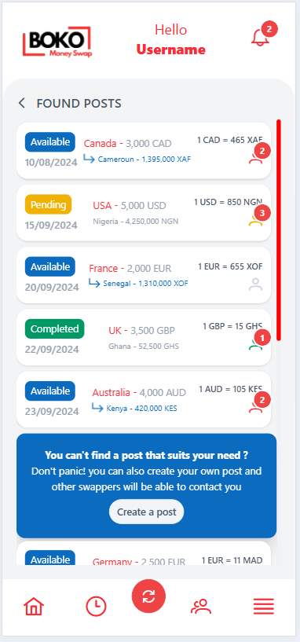
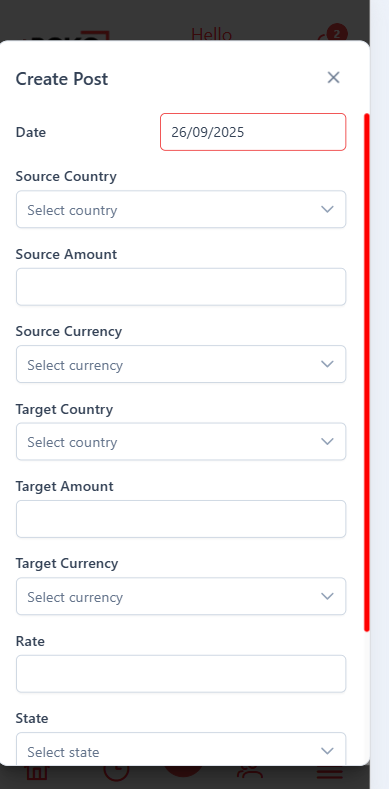
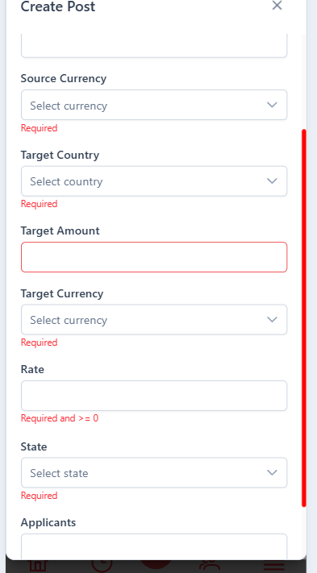
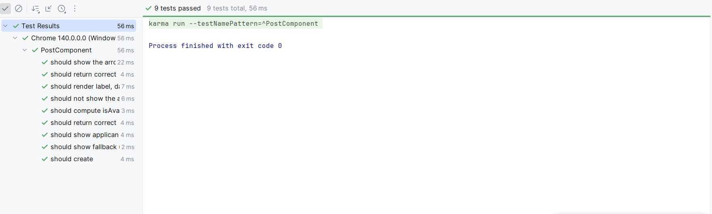
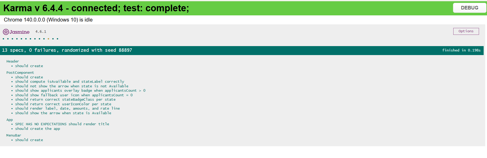

# README — Application Angular complète (Posts & Création)

Ce projet est une application Angular moderne permettant d’afficher une liste de “posts” (opérations de swap/transfert) et de créer de nouveaux posts via un formulaire dans une boîte de dialogue. L’interface est construite avec PrimeNG et Tailwind, et repose sur des composants Angular standalone.

Sommaire
- Présentation
- Fonctionnalités clés
- Pile technologique
- Architecture et composants
- Démarrage rapide
- Scripts npm usuels
- Tests unitaires
- Lignes directrices de code et qualité
- Zones d’images
- Améliorations possibles

Présentation
- Liste de posts avec détails: pays source/cible, montants formatés, devise, taux, état (Available, Pending, Completed, Cancelled), nombre d’applicants.
- Affichages dynamiques:
  - Badge d’état coloré
  - Icône/flèche selon l’état Available
  - Badge d’overlay pour les applicants (PrimeNG)
- Formulaire de création d’un post dans un p-dialog (validation basique, messages d’erreur, sélecteurs pour pays/devises).
- Expérience UI avec Tailwind + PrimeNG (thème Aura personnalisable).

Fonctionnalités clés
- Parcours principal:
  - Page d’accueil listant les posts.
  - Tous les 5 éléments, insertion d’un encart promotionnel invitant à créer un nouveau post.
  - Bouton “Create a post” ouvrant une boîte de dialogue avec un formulaire réactif (Reactive Forms).
- Gestion des états:
  - Affichage conditionnel de la flèche d’échange quand l’état est Available.
  - Couleurs et classes dérivées de l’état (badge, icônes).
- Formatages:
  - Date: dd/MM/yyyy (DatePipe).
  - Montants: regroupement de milliers (DecimalPipe / p-inputNumber).
- Accessoires UX:
  - p-overlay-badge indiquant le nombre d’applicants si > 0, sinon icône fallback.

Pile technologique
- Angular 20 (standalone components, provideRouter)
- TypeScript 5.9
- PrimeNG + PrimeIcons + thème Aura (personnalisable via preset)
- Tailwind CSS 4
- RxJS 7
- Outils Angular CLI, Karma + Jasmine pour les tests

Architecture et composants
- Configuration appli:
  - Configuration via ApplicationConfig (providers: router, animations, PrimeNG theme, zone change detection, global error listeners).
  - Thème PrimeNG appliqué au niveau global avec un preset personnalisable.
- Pages et sections:
  - Mise en page globale avec en-tête et barre de menu (Header, MenuBar).
  - Section principale: liste des posts avec scroll vertical, carte d’invitation à la création tous les 5 items.
- Composants UI:
  - PostComponent: carte d’un post (badge d’état, date, lignes source/target, taux, icône/badge d’applicants).
  - Formulaire de création dans un p-dialog:
    - Champs: pays source/target, montants, devises, taux, état, nombre d’applicants.
    - Validations: requis, >= 0 pour les montants, messages d’erreur contextualisés.
    - Actions: Cancel/Submit, désactivation du bouton tant que le formulaire est invalide.

Démarrage rapide
1) Prérequis
- Node.js LTS
- npm

2) Installer les dépendances
```shell script
npm install
```


3) Lancer en développement
```shell script
npm start
# ou si non défini :
npx ng serve
```

Application servie par défaut sur http://localhost:4200

4) Lancer les tests
```shell script
npm test
```


5) Build de production
```shell script
npm run build
```

6) Prod Link : https://boko-test-9l8j.vercel.app/


Scripts npm usuels
- start: lance le serveur de développement Angular
- build: compile pour la production
- test: exécute la suite de tests
  Note: adaptez selon votre package.json si les noms diffèrent.

Tests unitaires
- Vérifient la logique des getters (états, labels, classes calculées).
- Vérifient le rendu des dates, montants, devise, taux.
- Vérifient l’affichage conditionnel: flèche en Available, badges d’applicants ou fallback.
- Bonnes pratiques:
  - Préférez des attributs de test (data-testid) aux classes purement visuelles pour cibler les éléments en tests.
  - Si vous devez cibler une classe Tailwind arbitraire (ex. text-[0.7rem]) dans un sélecteur CSS, échappez-la dans querySelector, ou utilisez un data-testid.

Lignes directrices de code et qualité
- Composants standalone Angular + provideRouter pour un bootstrap léger.
- Utiliser Reactive Forms pour la saisie avec validations explicites.
- Centraliser les styles utilitaires avec Tailwind; limiter l’usage de classes arbitraires dans les tests.
- Thème PrimeNG configuré globalement (facile à switcher/ajuster).
- Prévoir des hooks de test stables (data-testid) pour diminuer la fragilité des tests d’intégration DOM.

Zones d’images

- Accueil — Liste des posts (état Available)
  - 
- Création d’un post — p-dialog + formulaire
  - 
  - 

- Résultats des tests
  - 
  - 

Améliorations possibles
- Internationalisation (i18n) des libellés et formats.
- Accessibilité: rôles ARIA, labels d’icône, focus management du dialog.
- Ajout de Storybook pour documenter visuellement tous les états du composant Post.
- Tests end-to-end (Playwright/Cypress) pour le parcours de création d’un post.
- Persistences/Backend: intégrer un service pour charger/sauvegarder les posts (mock, REST, etc.).
- Optimisations performance: virtual scroll pour longues listes, trackBy cohérent, lazy-load.

Besoin d’aide ou d’ajustements? Ouvrez une issue/PR et décrivez la section du projet à améliorer (UI, tests, config, DX).
